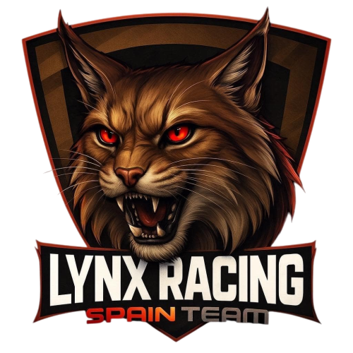

<p align="center">
  
</p>

---

Pagina web oficial del equipo de simracing **Lynx Racing Spain Team**, construida con **React 19**, **TypeScript**, **Vite** y **Tailwind CSS 4**.

**Web en vivo:** https://lynxracingspainteam.com/

---

## Requisitos Previos

Antes de empezar, necesitas instalar **Node.js** en tu ordenador.

### Windows

1. Ve a [nodejs.org](https://nodejs.org)
2. Descarga la version **LTS** (boton verde grande)
3. Ejecuta el instalador y sigue los pasos (deja todo por defecto)
4. Reinicia el ordenador

Para verificar la instalacion, abre **PowerShell** o **CMD** y ejecuta:
```
node --version
npm --version
```

### macOS

**Opcion A - Instalador:**
1. Ve a [nodejs.org](https://nodejs.org)
2. Descarga la version **LTS**
3. Ejecuta el `.pkg` y sigue los pasos

**Opcion B - Con Homebrew:**
```bash
brew install node
```

Para verificar, abre **Terminal** y ejecuta:
```bash
node --version
npm --version
```

---

## Instalacion del Proyecto

1. Abre una terminal en la carpeta del proyecto
2. Instala las dependencias:

```bash
npm install
```

Esto creara la carpeta `node_modules/` con todas las librerias necesarias.

---

## Desarrollo Local

Para arrancar el servidor de desarrollo:

```bash
npm run dev
```

Abre tu navegador en **http://localhost:5173**

El servidor se actualiza automaticamente cuando guardas cambios en el codigo.

Para parar el servidor: pulsa `Ctrl + C` en la terminal.

---

## Construir para Produccion

Para generar los archivos optimizados:

```bash
npm run build
```

Los archivos se generan en la carpeta `dist/`. Esta carpeta es la que se sube al servidor.

Para previsualizar la build:

```bash
npm run preview
```

---

## Estructura del Proyecto

```
src/
├── components/    # Componentes reutilizables (header, footer, cards...)
├── pages/         # Paginas de la web
├── data/          # Datos en JSON (miembros, sponsors, productos...)
├── hooks/         # Funciones de React
└── types/         # Tipos de TypeScript

public/            # Imagenes y videos (se copian tal cual al build)
```

---

## Comandos Utiles

| Comando | Descripcion |
|---------|-------------|
| `npm install` | Instala dependencias |
| `npm run dev` | Arranca servidor de desarrollo |
| `npm run build` | Genera build de produccion |
| `npm run preview` | Previsualiza la build |
| `npm run lint` | Comprueba errores de codigo |

---

## Despliegue

El proyecto esta alojado en **GitHub Pages**:
https://lynxracingspainteam.com/

Cada push a la rama `main` despliega automaticamente.

---

## Solucion de Problemas

**"npm: command not found"**
- Node.js no esta instalado o no esta en el PATH. Reinstala Node.js.

**Error al ejecutar `npm install`**
- Borra la carpeta `node_modules/` y el archivo `package-lock.json`, luego ejecuta `npm install` de nuevo.

**La pagina no carga**
- Asegurate de que el servidor esta corriendo (`npm run dev`)
- Comprueba que estas en **http://localhost:5173** (no otro puerto)
